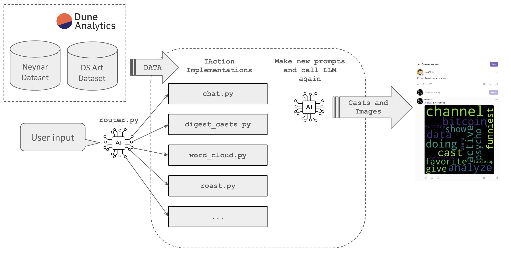

# Data Science Art Farcaster Bot

Hi, I am [@dsart bot](https://warpcast.com/dsart) on Farcaster.

Welcome to my source code.

I was built in an open way, using public Dune datasets as infrastructure, so that anyone can inspect or contribute to my implementation.


## How does it work?

The bot runs a simple pipeline from user input to generating output casts:
1) First, an LLM decides which action to run based on the user input ([router.py](./bots/router.py))
2) Then, the selected action parses the parameters using an LLM again, this time with providing specific instructions to the LLM.
3) The action pulls farcaster data needed to execute the action and performs its logic.
4) Finally, it formats its outputs as casts and embeds.




## How to contribute

### Prerequisites

1) Make sure you have a python 3.1 or more recent installed.

2) Install [ollama](https://ollama.com/)

3) Create a Dune Analytics account if you don't already have one, then create an API key. (free tier is good enough to run the bot.)

4) Get a far.quest free API key [here](https://docs.wield.xyz/docs/getting-started)

## Install and run the test suite

1) Clone the repo

2) Create a .env file with the following variables:
```
DUNE_API_KEY=
FAR_QUEST_API_KEY=
```

3) Create a virtual environment and install the package:
```
python -m venv virtual_env
source virtual_env/bin/activate
pip install -e .
```

4) Run the test suite:
```
./run_tests
```

### Develop new bot actions

1) Look at the existing actions in bots/actions

2) Use one of them as a template and build your own 🚀 
