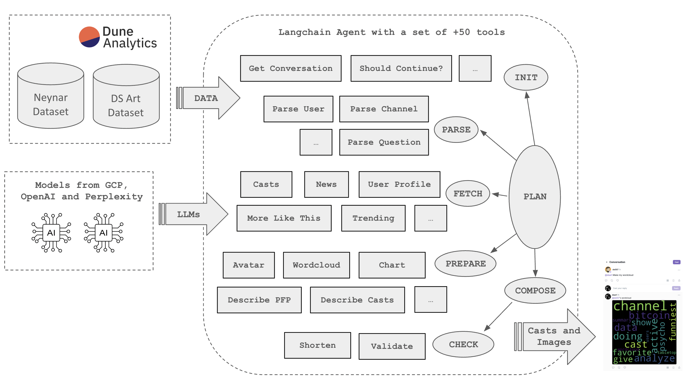

# Data Science Art Farcaster Bot

Hi, I am [@dsart bot](https://warpcast.com/dsart) on Farcaster.

Welcome to my source code.

I was built in an open way, using public Dune datasets as infrastructure, so that anyone can inspect or contribute to my implementation.


## How does it work?

The bot runs on langchain framework and has access to a set of tools to respond or create a new cast on Farcaster.
It integrates Dune queries, Google Gemini, OpenAI and Perplexity LLMs and image generation models.



## Available Tools

The tools are organized in multiple folders to facilitate planning and execution of complex workflows:

- `init`: Initialize the bot with basic information about itself, the conversation, and current context.
- `intent`: Identify the current intent that the bot should respond to.
- `plan`: Plan the response to the user's message.
- `parse`: Parse parameters before calling fetch and prepare tools.
- `fetch`: Fetch data.
- `prepare`: Transform data and prepare summaries, wordclouds, charts, tables, or other media to post.
- `compose`: Compose a cast or a thread of casts with mentions and embeds.
- `check`: Check the composed casts before posting.
- `memorize`: Memorize elements of the pipeline for future use.
- `helpers`: Utils that are not called directly by the agent, but can be required by some tools as dependencies.

## Tool parameters and dependencies.

While still compliant with the standard langchain tool interface, our tools share parameters and context through the state object rather than passing parameters as arguments.

They also define their dependencies as metadata in terms of attributes that they read (inputs) or write (outputs) into the state.

Example of a tool definition and metadata:
```
GetNews = Tool(
  name="GetNews",
  description="Get a news story",
  metadata={
    'inputs': ['search'],
    'outputs': ['yahoo_news', 'data_yahoo_news']
  },
  func=fetch
)
```


## How to contribute

### Prerequisites

This bot integrates a multitude of LLMs and data sources. Here is the list of requirements to run it locally: 

* python 3.1 or more recent installed.
* GCP service account with Gemini access.
* Neynar API key.
* Dune Analytics API key.
* far.quest free API key [here](https://docs.wield.xyz/docs/getting-started)
* OpenAI API key.
* Perplexity API key.
* [ollama](https://ollama.com/)
* Postgres DB (I still don't have a database script that creates a local test database, contact me for help setting one up.)
* Langsmith account for monitoring.

## Install and run the test suite

1) Clone the repo

2) Create a .env file with the following variables:
```
GOOGLE_APPLICATION_CREDENTIALS=
GCP_PROJECT_ID=
GCP_REGION=
GCP_BOT_BUCKET=

DATABASE_URL=postgresql://

DUNE_API_KEY=
FARQUEST_API_KEY=
PERPLEXITY_API_KEY=
OPENAI_API_KEY=

TEST_BOT=
LANGSMITH_TRACING=true
LANGSMITH_ENDPOINT="https://api.smith.langchain.com"
LANGSMITH_API_KEY=
LANGSMITH_PROJECT=
```

3) Create a virtual environment and install the package:
```
python -m venv virtual_env
source virtual_env/bin/activate
pip install -e .
```

4) Run the test suite:
```
./run_tests # to run all tests
python -m unittest tests.test_word_cloud.TestWordCloud.test8   # to run a specific test
```

### Develop new bot tools

1) Look at the existing actions in bots/tools

2) Use one of them as a template and build your own 🚀 
