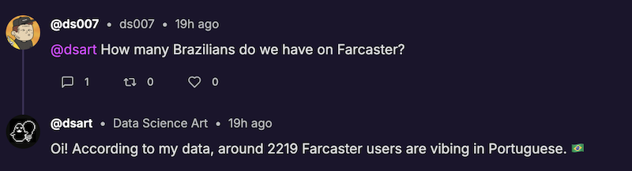

# My Journey into Farcaster AI Agents: 


## The Challenge: How many Brazilians do we have on Farcaster?

When I started building my bot on Farcaster, I found it pretty easy in the beginning, and didn't even need a framework. 
Coming from years of classic software enginnering, LLMs feel so powerful.
After defining some data access functions, most of the logic doesn't need to be written in python anymore, just tell the LLM what you want and it will figure out which tools to use and get you an answer.

Many AI solutions out there, including leading ones like OpenAI, advertise that the sky is the limit now: you just need to plug in your tools and the LLM will know how to use them to respond to any user request.

But the truth is, I found that it only works with a limited set of tools, and only if they are very simple and independent. For example, add a tool for the weather and another one for the stock prices, and the agent will properly trigger them and provide good answers that require a weather forecast or some stock price. But if you plug-in 10 or more different tools, it becomes a mess. The agent gets confused with too many options and starts calling them, not like a programmer would do, 
but like someone who never used them before. They would make very approximate decisions on how to write a program, learn by trial and error, and at some point go on a goose chase and forget what they were trying to achieve in the first place.

As I started adding more tools to my agent library: searching casts with a keyword, with a search phrase, selecting a user, describing their PFP and casts, generating an avatar, etc. The agent became more and more unreliable.

Here is a simple example: Someone asks "How many Brazilians do we have on Farcaster?" 

The correct plan is to call `MakeUserStatsSQLQuery` followed by `GetUserStats` tools; but when using the standard way of plugging tools to an LLM, it fails half of the time to respond with the correct answer.
Sometimes it tries forwarding the question to Perplexity, or searches for all casts with keyword brazil, and sometimes, even if it starts with `MakeUserStatsSQLQuery`, it realizes that the table doesn't have a country field, and won't go ahead with the correct next step. Interestingly, it will be smart enough to use the portuguese language as a proxy to find brazilians because `MakeUserStatsSQLQuery` is pretty flexible. But because the main prompt doesn't say anything about being flexible when it comes to statistics, it doesn't proceed afterwards.

One could propose an easy solution, why not simply add "it's ok to return an approximative number if you can't get the exact one." to all the prompts that will be used by the agent along its execution pipeline; but I learnt the hard way that such approach never converges. When provided with +50 tools, adding such hacks will improve one use-case and degrade another. And issues like this will keep raising and bloating the prompts with more and more edge cases.

So, in summary, even if frameworks like AutoGPT, LangChain and OpenAI lead the way and provide foundations for building AI agents, the core challenge remains: 
*how do we equip LLMs with large tool sets, while maintaining control over their behavior and ensuring reliable results?*

## Existing Approaches

### [BabyAGI1](https://github.com/yoheinakajima/babyagi)
BabyAGI1 (2023) takes an interesting approach by breaking down tasks into smaller subtasks and managing them through an LLM loop. 
Elegant in its simplicity, this approach turns an LLM into an excellent assistant for broad, research-style tasks.
The sequential nature of task decomposition works well for some use cases, but becomes less effective when dealing with the specific, interconnected operations needed for social media interactions. 
For instance, if you ask it "How many Brazilians do we have on Farcaster?", instead of simply chaining a couple of tools, it will go into an infinite loop trying to describe a plan, it might even propose installing a Farcaster hub, replicating data to Postgres, and running a SQL query. This strategy could actually work but it would take days, maybe even weeks, to complete.
This repo is not a good fit for my use case, and is deprecated anyways, but I find it interesting that this approach, if given enough time and resources, is in theory capable of solving any problem if all the information needed is publicly available online. Or maybe not? I guess we'll never know because it's too slow and too costly to test.

### [BabyAGI2](https://github.com/yoheinakajima/babyagi-2o)
BabyAGI2 (2024) builds on top of baby1, and introduces the concept of self-building agents, AIs that can construct their own tools and capabilities on the fly. 
I never tested it yet, but if it truly thinks like a developer, and if it's capable of writing the correct python function for each situation and make the best use of the available tools, that would be amazing. 
My 2 cents is that it adds complexity, uncertainty and some serious security risks, but the self-building-functions concept is something I will keep in mind for future versions.

### [AutoGPT](https://github.com/Significant-Gravitas/AutoGPT), [OpenAI Agents](https://github.com/openai/openai-agents-python) and [LangChain](https://github.com/langchain-ai/langchain)
These frameworks represent the current state-of-the-art in AI agent development, each with their own approach to tool orchestration.
The following is Claude3.5's review of their features and pros/cons:

| Feature | AutoGPT | OpenAI Agents | LangChain |
|---------|---------|---------------|-----------|
| Tool Definition | Custom format | Function calling | Flexible interface |
| Memory Management | Built-in | Limited | Pluggable |
| Planning | Multi-step | Single-step | Configurable |
| Tool Discovery | Dynamic | Static | Static |
| Error Handling | Retry logic | Basic | Customizable |
| Deployment | Self-hosted | API-based | Framework-agnostic |

Let's see how each handles our Brazilian users question:

**AutoGPT** takes an ambitious approach with continuous planning and execution cycles. When asked about Brazilian users, it might:
1. Search for demographic data
2. Try to analyze user profiles
3. Look for Portuguese language usage
4. Attempt to correlate multiple data points

While thorough, this approach often leads to analysis paralysis - the agent keeps exploring new angles instead of executing a simple query chain. The framework excels at complex research tasks but can overcomplicate straightforward requests.

**OpenAI Agents** offers a more streamlined experience through function calling. It would likely:
1. Identify the need for demographic analysis
2. Call an appropriate function if available
3. Return results directly

However, its simplified approach means less flexibility when tools need to be chained together. If the direct path (country data) isn't available, it might struggle to find alternative approaches (language analysis) that require multiple tool combinations.

**LangChain** provides a middle ground with its modular architecture. It can:
1. Use different agent types for different scenarios
2. Chain tools together flexibly
3. Maintain context between steps

This flexibility is powerful but requires careful implementation to prevent the same tool confusion issues we discussed earlier. Without proper guardrails, even LangChain agents can get lost in the possibility space of available tools.

Each framework has made important contributions to the field:
- AutoGPT pioneered autonomous planning and execution
- OpenAI Agents standardized function calling
- LangChain provided a flexible foundation for custom implementations

My personal take is that all 3 of them overlap more than they differ. I found AutoGPT easy to kick off but less flexible. On the other hand, OpenAI and LangChain can both provide more control. 

Both OpenAI's and Langchains frameworks are open source, but I picked LangChain because it's the most independent option and has the most potential to be extended towards any experimental direction. OpenAI's framework will probably be more driven towards consuming OpenAI's models rather than alternatives, while LangChain is not tied to any specific model provider.

Now, I could have gone with any of these frameworks, the challenge would still be the same. I found that none of them provides something that works out of the box for a large set of tools. So here is how I (kind of) solved it so far...

## Organizing my tools

First, I started by applying some clean code principles: if even myself can't easily visualize the available tools and how they depend on each other, how can I expect an LLM to do that?

So, I put a lot of effort into defining single-responsibility simple tools that work well with each other, included the input/output metadata for each one, 
and organized them into categories depending on what they do: 

```
- init: Set up context and basic info
- intent: Determine what needs to be done
- plan: Plan and select tools
- parse: Extract key parameters
- fetch: Gather required data
- prepare: Transform data into charts, tables, images, or prepare summaries
- compose: Create the actual posts
- check: Verify before posting
- memorize: Store relevant info for future use
```

Technically, the tools all implement the same interface, but by organizing them, I can guide the LLM to use them in the best way possible more efficiently.

## Divide and Conquer

Because of all the hype about AI Agents, I think we currently expect too much from them:
1. Autonomous and flexible: adapt to any variation in the instructions.
2. Reliable: they should either use the tools available for them efficiently or say they can't perform the task.
3. Performant: we want them to spend enough time to perform the task properly, but not more than a reasonable minute or two.

After a lot of trial and error, I figured that it's too hard to optimize for all these things at once, so I decided to divide and conquer.

I defined 3 distinct modes of operation:
1. Blueprint: deterministic behavior.
2. Bot: intermediate level of flexibility.
3. Assistant: highest freedom for the LLM to decide what to do.

### Blueprint Mode
In this mode, the agent becomes a script written in my framework's language, with a predefined sequence of tools to be executed.
For example, in this [Farcaster frame](https://warpcast.com/dsart/0xc9ac45cb), I need my agent to pull user data, create a new avatar for them, and generate a structured profile to be able to match them with other users; and I want it to do that the exact same way for every user.
So I just force the agent to follow this `WhoIs` blueprint:
```
BLUEPRINTS = {
  ...
  'WhoIs': [
    'GetBio', 
    'GetLore', 
    'GetStyle', 
    'GetTime', 
    'GetUserProfile', 
    'GetCastsUser', 
    'GetUserRepliesAndReactions', 
    'DescribePfp', 
    'DescribeUserCasts', 
    'DescribeUserRepliesAndReactions', 
    'CreateAvatar',
    'SaveUserProfile'
  ],
  ...
}
```
Ok, easy win, and one class of use-cases that I don't have to worry about anymore.


### Bot Mode
I use this mode for my agent to respond to other users when tagged or replied to on the Farcaster network.
Since I expect the requests or questions to be short and simple, I don't want to allow my agent to go too crazy here. 
So, I defined a set of possible [intents](../bots/tools/intent/intents.py) for which we have good tools, and I only run the LLM once to detect the intent, pick the pre-set target tools, and extend the prompt that will compose the response. 
The agent still works on the original instructions so it will adapt to it as much as possible, 
but the pre-set target tools act like guardrails to make it much more reliable when it's a task it was designed to handle.
This actually solved the initial challenge in a very practical way: the agent will pick the `UserStats` intent 100% of times when asked for a statistic about users, which will guide it to target the `GetUserStats` tool, and add this directive when it's time to compose the reponse: `Compose a data driven response`.
It's not very fancy, but it works 🎯   



### Assistant Mode
In this mode, I want the agent to perform a task and post the result on behalf of its owner.
For example, here are the instructions I am giving it to post on my behalf in a channel dedicated to classic cars:
```
Your goal is to post an interesting news story about classic cars in channel /retroparc.
Create a search phrase that will be interesting to the channel audience and can yield news about classic cars.
Use the search phrase to check out the news then compose an engaging cast about it.
Include a link to the story.
```
The simple intent detection that works well when conversing with the agent online (bot mode), is not enough here, because I expect the assistant owners to propose elaborate multi-step plans, and the available tools already offer infinite possibilities. 
So, in this mode, I don't rely on the pre-set intents, but let the LLM decide its targets almost freely.

Almost? Yes, I tried different variations of the planning function, including the most flexible ones akin to BabyAGI1, but I wasn't happy with the results, it would not apply the best plan about 50% of the times. Therefore, even in my most flexible mode, I still apply a big restriction: I only let it plan the tools once, and I help it by `compiling` the tool sequence after the LLM has selected some target tools.

While this achieves more flexibility than bot mode, it still doesn't unleash all the potential of my tool library. For example, the assistant can't iterate and re-adjust the plan as he uses his first tools and learns new information. 

But it works and passes my unit tests suite for now... 

## Learnings

### The Tool Sequence Compiler
I mentioned that I help the LLM by `compiling` the tool sequence after it has selected some target tools.
This is actually a trick that makes a big difference in reliability and performance.
We know the tools are organized into categories and their dependency graph is well defined in terms of required inputs and output metadata.
With that information, I can present to the LLM only the tools that are real targets, and hide the ones that are typically used as intermediate steps.
Then I can reverse-engineer the tool sequence to run the target tools in the correct order.
Now, the dependecy graph is not linear and there will be choices to make to select which pre-requisite tool to run first, but that's ok, the LLM is good at making those decisions, especially when it can focus on choosing from a small set of options and it is provided with a clear question: you know that you want to run this tool next, so which one of these dependencies applies best in this context?
It's basically replicating how a human developer would go about writing a program: starting from the end goal and choosing the intermediate steps while keeping focus on a specific goal.
This idea works really well and it's probably a keeper in future versions.

### Focused LLM Usage
In general, there's an online consensus that LLMs work best when given a single, clear task with exactly the context it needs. 
There is always a temptation to add more to a prompt to fix an edge case, but as I experimented more and more, I realized that when a prompt is not always successful, it's better to split it into smaller prompts that are more reliable rather than adding to it.
My tools and planning steps follow this principle rigorously now, and it works pretty well.
For example, when calling a tool that applies to a user profile, we need to parse a user parameter. 
It's a very basic task, but rather than incorporating with an other higher level tool, I found that making it its own atomic tool works way better.
Here is how the prompt looks like in the `ParseUser` tool, which will only be shown the conversation and these instructions:
```
You are @{{name}}, a bot programmed to analyze user data and perform actions such as describing, analyzing, praising, roasting, etc.
Based on the provided conversation, who should your tools target?
You must only extract the user parameter so that you can set the user parameter.
Users typically start with @, but not always.
If the request is about self or uses a pronoun, study the context and instructions carefully to figure out the intended user.

#RESPONSE FORMAT:
{
  "user": ...
}
```
By repeating the word "user" so many times and solving the pronoun edge cases in this tool, and here only, it works 100% of times.

### Unit Tests
This is not specific to AI Agents development, but I found that unit tests play a fantastic role in designing the tools and prompt engineering. 
I have a suite of 86 tests that cover most of the tasks I expect my agents to be successful at.
I use them not only to validate my changes, but also to measure the overall speed and introspect what is going on in different scenarios.

### Monitoring
Finally, I also monitor the agents runs both in production and in the test suite through the langsmith frontend (super usefule part of the LangChain framework.)
There's a lot of data that will flow through an AI agent run, each prompt and output will be a long text and it quickly becomes an impossible mess if you try to a generic logging system, how do you even debug images in a text log file? 
In langsmith, you can visualize the steps and tool calls in a structured way and zoom in the prompts inputs and outputs one at a time. 
It also reports the number of tokens used and the cost of the operation, which is great for cost optimization.

## What's next?

My current framework is pretty reliable with its set of about 50 tools. 

My next milestone is to scale it to hundreds of tools while maintaining or improving reliability. 

There is also a key insight from BabyAGI2 that resonates with me: treating AI planning more like a programming task.

Instead of having the LLM select from predefined tool sequences, I envision a system where it can generate custom sequences just like it would generate Python code. This would combine the best of both worlds:
1. The structured, deterministic nature of programming that makes tools reliable
2. The creative, adaptive capabilities of LLMs that make them powerful

Also, I haven't even touched the new generation of reasoning models and these could actually completely change the game here.

In summary, my take-away is that building reliable AI agents is an exciting challenge that sits at the intersection of traditional software engineering and modern AI capabilities. While frameworks like LangChain provide excellent foundations, I still have so much to learn.

I'll continue sharing my experiments and learnings as this framework evolves; and would love to hear your feedback and suggestions!


